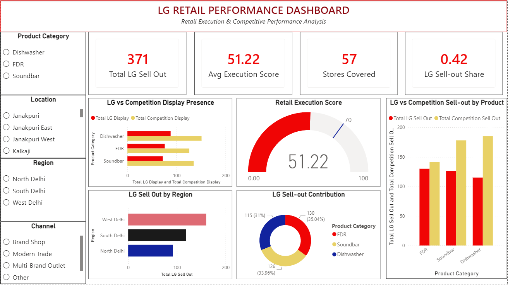

# LG Retail Performance Dashboard

## Project Overview

The **LG Retail Performance Dashboard** is an interactive Power BI dashboard developed during my internship at **LG Electronics India Pvt. Ltd.**
The dashboard analyzes retail execution and product performance across multiple retail outlets, helping identify **display gaps, competitive presence, sell-out performance, promoter execution, and store-level opportunities**.

The project focuses on converting retail audit data into actionable business insights that can support better **retail execution, visibility, and sales performance**.

## Project Objectives

- Monitor retail execution across LG outlets.
- Evaluate the availability and quality of LG product displays.
- Analyze sell-out performance across stores and product categories.
- Identify gaps in retail execution and product visibility.
- Compare LG's retail presence with competitors.
- Highlight stores requiring corrective action.
- Generate actionable recommendations for improving retail performance.

## Tools & Technologies

- **Power BI** – Dashboard development and data visualization
- **Microsoft Excel** – Data preparation and analysis
- **DAX** – KPI calculations and measures
- **Data Visualization** – Interactive charts, KPIs and slicers
- **Retail Audit Data** – Store-level performance and execution analysis

## Key KPIs

- **Total Stores Audited** – Number of retail outlets covered during the retail audit.
- **Display Availability** – Measures the availability of required LG product displays across audited stores.
- **LG Display Execution** – Evaluates LG's retail display presence and execution across stores.
- **Sell-Out Performance** – Tracks product sales performance across the audited retail network.
- **Execution Achievement** – Measures retail execution performance against defined targets.

## Dashboard Features

The dashboard provides an interactive view of:
- Store-level retail performance
- Product category performance
- LG display availability
- Competitive display presence
- Sell-out performance
- Promoter execution and hygiene
- Retail execution gaps
- Store-level opportunities
- Performance against execution targets

Interactive filters and visualizations allow users to analyze performance across different **stores, regions, channels and product categories**.

## Key Business Insights

The dashboard helped identify several important retail execution patterns:
- LG achieved 371 units of sell-out, with an overall LG sell-out share of 42%, indicating that competitors have a stronger overall sales position.
- FDR is LG's strongest-performing category with 130 units, followed by Soundbar at 126 units and Dishwasher at 115 units.
- Competitors outperform LG across all three categories, with the largest sell-out gap in Dishwasher, followed by Soundbar.
- Competitor display presence is higher than LG across all three product categories, indicating a clear visibility gap at the retail level.
- West Delhi has the highest LG sell-out, followed by South Delhi and North Delhi.
- The average retail execution score is 51.22, showing considerable scope for improving overall store-level execution.

## Recommendations

Based on the dashboard analysis:
- Increase LG display presence in stores where competitor visibility is significantly higher.
- Prioritize Dishwasher and Soundbar for stronger in-store promotion and conversion activities because of their larger competitive sell-out gaps.
- Leverage FDR's stronger performance by identifying and replicating the successful retail practices used in this category.
- Strengthen promoter execution through better product knowledge, hygiene, engagement and regular performance monitoring.
- Focus corrective actions on low-performing stores and regions rather than applying the same strategy across all outlets.
- Conduct regular retail audits to track display availability, competitive presence, sell-out and execution score over time.

## 📷 Dashboard Preview

---

## 📁 Project Files

- 📊 [Power BI Dashboard](LG-Retail-Performance-Dashboard.pbix)
- 📄 [Project Report](LG-Retail-Performance-Report.pdf)
- 🖼️ [Dashboard Preview](Dashboard.png)

---

## 🎓 Project Context

**Organization:** LG Electronics India Pvt. Ltd.
**Project Area:** Retail Operations & Field Marketing
**Tool:** Microsoft Power BI
**Project Type:** Internship Project

The project provided practical exposure to **retail auditing, competitive benchmarking, store-level analysis, data visualization and business decision-making**.

---

## 👤 Author

**Amit Chaudhary**

PGDM | Marketing | Operations | Power BI | Excel

[GitHub Profile](https://github.com/18amitchaudhary-pixel)

